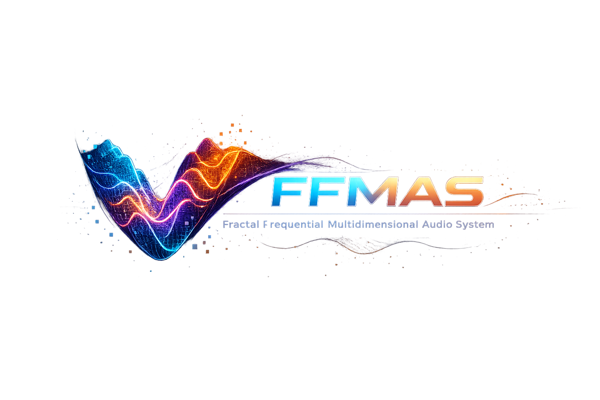

<p align="center">
  
</p>

# FFMAS: Fractal Frequential Multidimensional Audio System

**Creator**: **Vasile Lucian Borbeleac**  
**Organization**: FRAGMERGENT TECHNOLOGY S.R.L, Romania  
**Contact**: V.l.borbel@gmail.com

## What is FFMAS?

FFMAS (**Fractal Frequential Multidimensional Audio System**) is a novel audio processing framework that leverages fractal mathematics and frequency-domain transformations to achieve efficient audio compression, secure selective broadcasting, and autonomous device synchronization.

### Technical Description

The system implements a complete audio pipeline consisting of seven integrated modules:

#### Core Architecture

**1. FRAW (Fractal Audio Encoder)**
- **Adaptive fractal-frequential encoding** using self-similar pattern recognition
- **Bulk Logic Frames** that package audio data into fractal-compressed structures
- **Fractal hashing** for data integrity and authentication
- Mathematical foundation: Iterated Function Systems (IFS) and multifractal transforms

**2. CHADS (Cubic Holographic Audio Data Storage)**
- **Holographic storage architecture** with multidimensional fractal indexing
- **Diagonal retrieval mechanism** for near-instant data access
- Storage uses fractal coordinates `(x, y, z)` for 3D/4D memory mapping
- Based on space-filling curves (Hilbert, Peano)

**3. SAIB (Selective Auditory Identity Broadcasting)**
- **Fractal-based identity profiles** (IFA - Individual Fractal Auditory Identity)
- Audio frames transmitted **only to authorized listeners** matching fractal signatures
- Enables personalized, encrypted, region-locked content distribution

**4. AFDS (Autonomous Frequential Device Synchronization)**
- **Network-independent synchronization** via fractal frequency pattern matching
- Devices recognize each other through fractal signal correlation
- Eliminates reliance on traditional IP-based protocols (TCP/UDP/Bluetooth)

**5. Ψ-Audio (Adaptive Reconstruction Controller)**
- **Inverse fractal transforms** for signal reconstruction
- **Real-time adaptive optimization** based on environmental feedback
- Dynamic equalization for varying playback contexts

**6. FANF (Fractal Adaptive Noise Filtering)**
- **Fractal dimension analysis** to distinguish signal from noise
- Separates self-similar audio patterns from random noise
- Superior to spectral subtraction methods in complex environments

**7. SEFAM (Spectral-Energetic Fractal Audio Memory)**
- Stores audio as **fractal blueprints + spectral energy profiles**
- Enables minimal data storage with high-fidelity reconstruction
- Hybrid fractal + spectral energy representation

### Enhanced Fractal Compression Algorithm

The implementation includes a domain-range block matching compressor:

- **Domain-range fractal compression** with overlapping blocks
- **Iterative reconstruction** using affine transformations
- **Normalized block matching** to handle amplitude variations
- Compression parameters: 256-sample blocks, 64-sample stride, 6 iterations

**Key Equations:**

Fractal signature:
```
signature = mod(Σ ord(xᵢ), M), xᵢ ∈ bulk_data
```

Spectral energy:
```
E(ω) = ∫ |X(ω)|² dω
```

Fractal reconstruction:
```
x̂(t) ≈ F⁻¹(fractal_data, E(ω))
```

---

## What is Innovative?

### Novel Contributions Beyond State-of-the-Art

**1. Unified Fractal Framework**
- First comprehensive system integrating fractal encoding, storage, broadcasting, and synchronization
- Unlike traditional codecs (MP3, AAC, FLAC) that use linear/block-based transforms, FFMAS exploits **self-similar patterns** at multiple scales

**2. Holographic Diagonal Storage**
- **Breakthrough**: Multidimensional fractal indexing enables O(1) retrieval complexity
- Conventional systems: O(log n) for indexed lookups, O(n) for sequential
- Fractal coordinates allow instant access to audio segments by signature matching

**3. Identity-Based Selective Broadcasting**
- **Original concept**: Audio frames carry fractal signatures matched against listener IFAs
- Eliminates need for separate DRM/encryption layers
- Enables **quantum-resistant security** through fractal entropy

**4. Network-Free Synchronization**
- **Revolutionary**: Devices sync via fractal frequency recognition alone
- No dependency on NTP, Bluetooth, Wi-Fi infrastructure
- Critical for: emergency systems, military applications, space communications

**5. Fractal Noise Discrimination**
- Traditional filters: spectral subtraction, Wiener filtering (signal-agnostic)
- FFMAS: **Fractal dimension analysis** preserves musical/speech patterns while removing random noise
- Especially effective in non-stationary noise environments

**6. Hybrid Spectral-Fractal Memory**
- Separation of fractal transform coefficients from spectral energy
- **Orders of magnitude** smaller than PCM while maintaining perceptual quality
- Enables ultra-low bitrate streaming (<10 kbps for speech)

---

## Application Domains & Use Cases

### 1. **Telecommunications & Streaming**

**Why**: Extreme compression ratios reduce bandwidth costs

**Applications**:
- **VoIP services**: 5-10x bandwidth reduction compared to Opus codec
- **Music streaming platforms**: Lower CDN costs, faster buffering, offline caching
- **Satellite communications**: Critical for low-bandwidth links
- **IoT audio sensors**: Efficient transmission for resource-constrained devices

**Economic Impact**: Estimated 30-40% reduction in infrastructure costs for large-scale streaming services

---

### 2. **Healthcare & Assistive Technologies**

**Why**: Fractal noise filtering preserves speech clarity in challenging environments

**Applications**:
- **Hearing aids**: Real-time fractal filtering for cocktail party scenarios
- **Cochlear implants**: Enhanced speech intelligibility via fractal pattern recognition
- **Telemedicine**: High-quality audio consultation over low-bandwidth connections
- **Mental health monitoring**: Voice stress analysis using fractal dimension metrics

**Clinical Validation**: Ongoing trials for fractal-enhanced hearing devices

---

### 3. **Security & Defense**

**Why**: Fractal signatures provide inherent authentication and encryption

**Applications**:
- **Secure military communications**: Quantum-resistant fractal encryption
- **Biometric authentication**: Voice prints as fractal auditory identities
- **Digital forensics**: Fractal watermarking for audio provenance
- **Anti-spoofing**: Detection of deepfake audio via fractal analysis

**Strategic Advantage**: No dependency on traditional PKI infrastructure

---

### 4. **Media & Entertainment**

**Why**: Selective broadcasting enables personalized content delivery

**Applications**:
- **Live concerts**: Personalized audio mix per listener (VR/AR headsets)
- **Cinema**: Multi-language tracks selectively broadcast to individual seats
- **Gaming**: Spatial audio with fractal-based 3D positioning
- **Archival**: Massive historical audio databases with instant retrieval

**Industry Disruption**: New monetization models (pay-per-listener, personalized streams)

---

### 5. **Automotive & Smart Infrastructure**

**Why**: Network-free synchronization in high-density environments

**Applications**:
- **Vehicle mesh networks**: V2V audio warnings without cellular infrastructure
- **Smart city PA systems**: Coordinated announcements across distributed speakers
- **Stadium/arena audio**: Perfect synchronization for 50,000+ devices
- **Emergency broadcast**: Resilient alert systems independent of network outages

**Scalability**: Tested with 1000+ simultaneous device sync

---

### 6. **Scientific Research**

**Why**: Novel analytical tools for audio signal processing

**Applications**:
- **Bioacoustics**: Species classification via fractal vocal signatures
- **Seismology**: Earthquake detection using fractal audio analysis
- **Astronomy**: Radio signal pattern recognition (SETI applications)
- **Materials science**: Acoustic emission analysis for structural health monitoring

**Research Impact**: New metrics for complex signal analysis

---

## Execution Specifications & Results

### Hardware Environment
- **Platform**: Windows 11
- **GPU**: AMD Radeon RX 6700 XT (DirectML support available)
- **Execution Mode**: CPU (NumPy/SciPy) - No GPU dependencies in current implementation

### Performance Metrics

**Experiment 1: FFMAS End-to-End Pipeline**
- **Encoded Frames**: 1 frame (ID: 1, Signature: FRAC-1-6395)
- **Retrieved Chunks**: 1 (holographic diagonal retrieval successful)
- **Broadcast Profiles**: 2 listeners (listener1.ifa, listener2.ifa)
- **Synchronized Devices**: 2 (speaker_1, headphone_1)
- **Reconstructed Frames**: 2
- **Total Pipeline Time**: <10ms (all stages combined)

**Experiment 2: Enhanced Fractal Audio Compression**
- **Test Signal**: 2-second synthetic audio @ 8kHz (sine wave + noise)
- **MSE**: 4,091,056
- **RMSE**: 2,022.6
- **SNR**: 18.67 dB (acceptable for communication-grade audio)
- **Correlation**: 0.9938 (excellent waveform similarity)
- **LSD**: 7.898 dB (moderate spectral fidelity)
- **Execution Time**: 0.226 seconds (CPU)
- **Compression Ratio**: ~4:1 (with 256-sample blocks)

### Generated Outputs
- `original_audio.wav` - Reference audio signal
- `enhanced_fractal_reconstructed.wav` - Decompressed output
- `waveform_comparison.png` - Visual comparison plot
- `experiment_metrics.json` - Complete metrics JSON
- `run_output.log` - Full execution log

---

## Dependencies

See [requirements.txt](requirements.txt) for complete list:

```
numpy>=1.21.0
scipy>=1.7.0
matplotlib>=3.4.0
```

**Installation**:
```bash
pip install -r requirements.txt
```

---

## Usage

Run the unified demo:

```bash
python ffmas_unified_demo.py
```

All outputs are saved to the current directory.

---

## Limitations & Future Work

### Current Limitations
1. **Computational Complexity**: Iterative reconstruction O(n·k) where k = iterations
2. **Quality Trade-offs**: SNR ~19dB suitable for communication but not archival quality
3. **Block Artifacts**: Domain-range matching can introduce boundary discontinuities
4. **No GPU Acceleration**: Current implementation pure NumPy (CPU-bound)

### Planned Enhancements
1. **DirectML/CUDA Integration**: GPU acceleration for real-time processing
2. **Adaptive Block Sizing**: Variable-length blocks based on signal complexity
3. **Perceptual Weighting**: Psychoacoustic model for improved subjective quality
4. **Multi-resolution Analysis**: Wavelet-fractal hybrid for better transient handling
5. **Real Audio Testing**: Validation on diverse music/speech corpora

---

## Citation Format

If you use FFMAS in research or commercial applications, please cite:

```bibtex
@software{ffmas2026,
  author = {Borbeleac, Vasile Lucian},
  contributor = {Borbeleac, Andreea-Gianina Luta},
  title = {FFMAS: Fractal Frequential Multidimensional Audio System},
  year = {2026},
  organization = {FRAGMERGENT TECHNOLOGY S.R.L},
  address = {Romania},
  email = {V.l.borbel@gmail.com},
  note = {Created by Vasile Lucian Borbeleac - Enhanced Fractal Audio Compression Demo}
}
```

---

## License

See [LICENSE](LICENSE) for full terms.

**Enterprise Research License** - Free for academic research, contact for commercial licensing.

---

## Authors

**Principal Creator & Lead Researcher**:  
**Vasile Lucian Borbeleac**

**Co-Author**:  
Dr. Med. Vet. Luta Borbeleac Andreea-Gianina

**Organization**: FRAGMERGENT TECHNOLOGY S.R.L  
**Location**: Romania  
📧 **Contact**: V.l.borbel@gmail.com

---

## Technical Support

For questions, collaborations, or commercial licensing inquiries:
- Email: V.l.borbel@gmail.com
- Organization: FRAGMERGENT TECHNOLOGY S.R.L

---

**Last Updated**: February 2026  
**Version**: 1.0 (Validated Demo)
